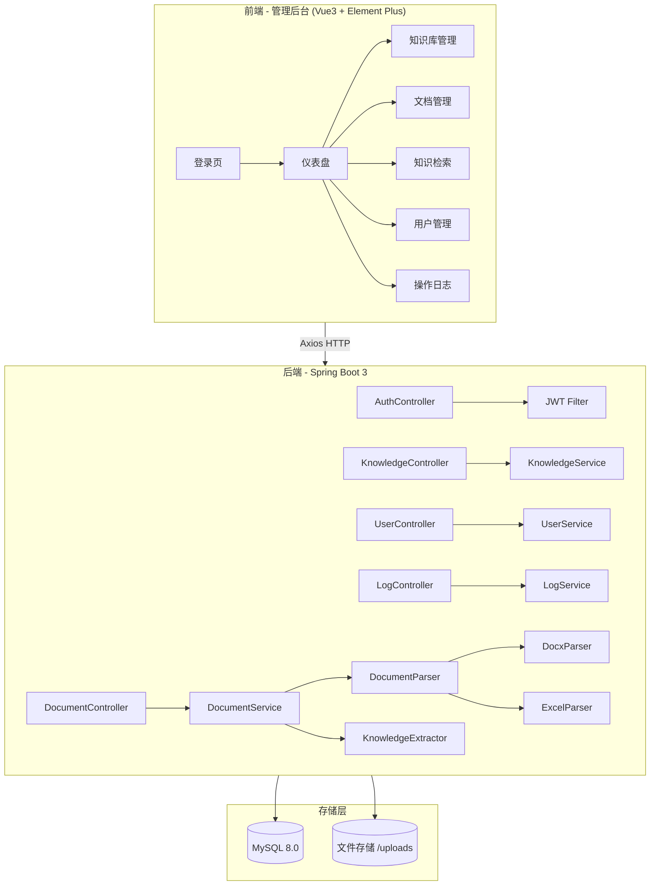
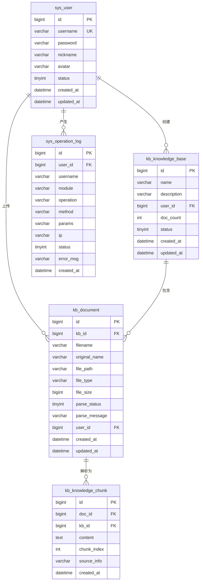

# 知识库系统 - 项目设计文档

## 1. 系统架构

## 2. ER 图

## 3. 接口清单

### AuthController `/api/auth`
| Method | Path | Description |
|--------|------|-------------|
| POST | /login | 用户登录，返回JWT |
| POST | /logout | 用户登出 |
| GET | /info | 获取当前用户信息 |

### UserController `/api/users`
| Method | Path | Description |
|--------|------|-------------|
| GET | / | 分页查询用户列表 |
| POST | / | 新增用户 |
| PUT | /{id} | 修改用户 |
| DELETE | /{id} | 删除用户 |
| PUT | /{id}/status | 启用/禁用用户 |

### KnowledgeBaseController `/api/kb`
| Method | Path | Description |
|--------|------|-------------|
| GET | / | 分页查询知识库列表 |
| POST | / | 创建知识库 |
| PUT | /{id} | 修改知识库 |
| DELETE | /{id} | 删除知识库 |
| GET | /{id} | 知识库详情 |

### DocumentController `/api/documents`
| Method | Path | Description |
|--------|------|-------------|
| GET | / | 分页查询文档列表 |
| POST | /upload | 上传文档(doc/excel) |
| DELETE | /{id} | 删除文档 |
| POST | /{id}/reparse | 重新解析文档 |
| GET | /{id}/chunks | 查看文档知识块 |

### SearchController `/api/search`
| Method | Path | Description |
|--------|------|-------------|
| GET | / | 全文检索知识内容 |

### LogController `/api/logs`
| Method | Path | Description |
|--------|------|-------------|
| GET | / | 分页查询操作日志 |

## 4. UI/UX 规范

| 属性 | 值 |
|------|-----|
| 主色调 | #4A90D9 (知性蓝) |
| 辅助色 | #67C23A (成功绿), #E6A23C (警告橙), #F56C6C (危险红) |
| 背景色 | #F0F2F5 (页面), #FFFFFF (卡片) |
| 字体 | -apple-system, "PingFang SC", "Helvetica Neue", sans-serif |
| 标题字号 | 20px / 16px / 14px |
| 正文字号 | 14px, 行高 1.6 |
| 卡片圆角 | 8px |
| 卡片阴影 | 0 2px 12px rgba(0,0,0,0.08) |
| 间距体系 | 8px / 16px / 24px / 32px |
| 按钮圆角 | 6px |
